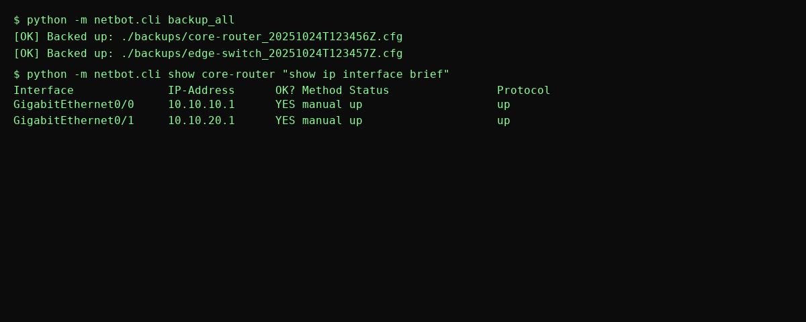

# **NetBot — Python Network Automation Bot**



## ** Project Origin**
**NetBot** was born from the need to **automate repetitive network tasks** in real-world labs and production-like environments.  
As networks grow in size and complexity, manual configuration and monitoring become error-prone and time-consuming.  
NetBot started as a small Python project to **simplify network operations**, and it evolved into a modular automation tool for routers and switches.

---

## ** Purpose**
- Reduce human errors in network management  
- Provide a fast and reliable way to backup, monitor, and configure devices  
- Serve as a learning platform for network automation and DevNet practices  
- Be a foundation for future enhancements like REST APIs, dashboards, and scheduling

---

## ** Core Features**
-  SSH-based device connection with **Netmiko**  
-  Automated backup of running configurations  
-  Execute show commands across multiple devices  
-  Push configuration templates via **Jinja2**  
-  Manage devices through YAML inventory files  
-  Parallel execution using threads  
-  Safe: credentials are never uploaded to GitHub

---

## ** Project Structure**
```
netbot/
├─ netbot/                # Core Python source code
│  ├─ connection.py       # SSH connection handling
│  ├─ tasks.py            # Backup and show command tasks
│  ├─ playbook.py         # Jinja2 template rendering and push
│  └─ cli.py              # Command-line interface
├─ templates/             # Jinja2 configuration templates
│  └─ add_vlan.j2
├─ examples/              # Sample files safe for GitHub
│  └─ devices.example.yml
├─ assets/                # Images / diagrams (CLI demo)
│  └─ cli_example.png
├─ requirements.txt
├─ .gitignore
├─ README.md
└─ LICENSE
```

---

## ** Quick Start**
```bash
# Install dependencies
pip install -r requirements.txt

# Copy example device file and edit with your lab credentials
cp examples/devices.example.yml devices.yml

# Run backups
python -m netbot.cli backup_all

# Run show command
python -m netbot.cli show sample-router "show ip interface brief"
```

---

## ** Security Best Practices**
- Never commit real device credentials.  
- Use `devices.example.yml` for public repos.  
- Add your real `devices.yml` to `.gitignore`.  

---

## ** Future Roadmap**
- REST API with **FastAPI** for web automation  
- Web-based dashboard for device management  
- Configuration versioning and diff tools  
- Scheduled automated backups  
- Integration with Ansible / NetOps tools  

---

## ** Philosophy**
NetBot is **more than a script**: it’s a **foundation for learning and scaling network automation**.  
It demonstrates **how Python can simplify network operations**, reduce manual errors, and accelerate DevNet workflows.
